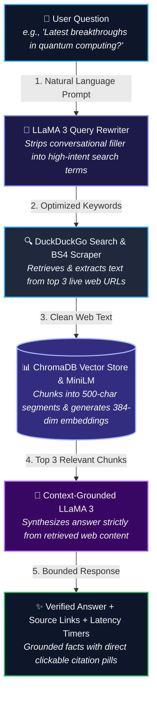

# ⚡ Web RAG Assistant — Executive Summary & Quick Guide

> **An on-device, zero-cost, privacy-first AI research assistant that connects local LLaMA 3 to live web search using dynamic Retrieval-Augmented Generation (RAG).**  
> *Looking for deep technical specs and math formulas? See the [Full Documentation (README.md)](file:///c:/LENOVOL340/portfolio/README.md).*

---

## 📌 What Is This Project?

Traditional AI models are frozen in time—they cannot answer questions about events that occurred after their training cutoff date without expensive third-party search and model subscriptions.

This project solves that limitation with an autonomous **Just-In-Time (JIT) Web RAG Pipeline**:
1. It takes any conversational user question.
2. Uses local **LLaMA 3** to rewrite the prompt into an optimized search query.
3. Automatically searches **DuckDuckGo** and retrieves the top 3 live web pages.
4. Breaks down and converts the live articles into mathematical vectors using **HuggingFace MiniLM**.
5. Stores them in a temporary in-memory **ChromaDB** vector database.
6. Synthesizes a factual, hallucination-free answer with direct clickable source citations.

💰 **Cost:** **$0.00 / month** (100% Free & Open-Source)  
🔒 **Privacy:** **100% Local & On-Device** (Zero user queries are sent to external cloud AI providers)

---

## 🏗️ Interactive System Flowchart

The diagram below illustrates how data flows between the user interface, the web search engine, the vector database, and the local AI model:



---

## 🔍 How It Works: Step-by-Step Breakdown

### Step 1: Query Reformulation
When a user asks: *"Hey, could you please tell me what are the biggest breakthroughs in quantum computing this week?"*, searching that entire sentence on the web yields suboptimal results.  

The local **LLaMA 3** model converts the conversational question into a clean search query:

> 💬 **User Question:** *"Hey, what are the latest breakthroughs in AI this week?"*  
> 🔍 **Optimized Query:** `latest AI breakthroughs developments this week`

### Step 2: Real-Time Web Scraping
* The optimized query is dispatched to **DuckDuckGo** (`ddgs`) to fetch the top 3 live result links.
* **BeautifulSoup4** traverses the HTML tree of each link, strips out scripts and advertisements, and extracts the readable body text.

### Step 3: Chunking & Local Embeddings
* Web pages are too large to feed directly into an LLM context window all at once.
* The system splits the text into chunks of 500 characters with a 50-character overlap using **RecursiveCharacterTextSplitter**.
* Each chunk is converted into a 384-dimensional dense semantic vector using HuggingFace's **all-MiniLM-L6-v2** model running on your CPU/GPU.

### Step 4: ChromaDB Semantic Matching
* The generated vectors are stored in an ephemeral in-memory **ChromaDB** instance.
* The system compares the user's question against all chunk vectors to retrieve the **Top 3 most relevant segments**.

### Step 5: Grounded Answer Synthesis
* The retrieved segments are fed to LLaMA 3 under a strict constraint:
  > *"Answer the user's question accurately using ONLY the context provided below. If you cannot answer based on the context, say so."*
* This **completely mitigates hallucination** because the model is not allowed to guess facts.

---

## 💡 Technical Architecture & Core Strengths

* **Asynchronous Web Service:** Built on **FastAPI** (`ASGI`) with non-blocking request handling, ensuring responsive client interactions and static asset delivery.
* **Intelligent Query Transformation:** Strips conversational noise and extracts high-density keywords using a single-pass LLaMA 3 query reformulator.
* **Context-Preserving Chunking:** Employs a 10% overlap ($50 / 500$ characters) to preserve conceptual continuity across paragraph transitions.
* **Dense Semantic Retrieval:** Sub-millisecond vector similarity search using Cosine distance inside an in-memory **ChromaDB** collection.
* **Hallucination Prevention:** Hard-bounds model output to verified web context, eliminating speculative parametric generation.
* **Cost & Privacy First:** Runs completely on-device with **$0 API costs** and **100% data privacy** (compliant with strict data governance standards).

---

## 🧰 Tech Stack Matrix

| Layer | Technology | Role |
| :--- | :--- | :--- |
| **Web Server** | **FastAPI** + **Uvicorn** | High-performance async Python backend & API endpoints |
| **LLM Inference** | **Ollama** (`llama3`) | On-premise local open-weight language model |
| **Orchestration** | **LangChain** | Pipeline chaining loaders, splitters, embeddings, and models |
| **Vector DB** | **ChromaDB** | High-speed in-memory vector indexing and cosine retrieval |
| **Embedding Model** | `all-MiniLM-L6-v2` | Fast 384-dimensional dense semantic text embeddings |
| **Search Engine** | **DuckDuckGo** (`ddgs`) | Real-time live web query execution without rate-limit tokens |
| **HTML Parser** | **BeautifulSoup4** | Document cleaning, boilerplate removal, and text extraction |
| **Frontend UI** | **HTML5 / CSS3 / Vanilla JS** | Responsive dark-mode glassmorphic chat interface |

---

## 🚀 Quickstart: Run in 3 Minutes

### 1. Start Ollama with LLaMA 3
Make sure [Ollama](https://ollama.com) is installed:
```bash
ollama pull llama3
ollama run llama3
```

### 2. Install Project Dependencies
```bash
# Activate your virtual environment first
pip install -r requirements.txt
```

### 3. Launch the Server
```bash
python app.py
```
Open your browser and navigate to:
```
http://127.0.0.1:8000
```

---

## ⏱️ Live Response & Telemetry Preview

Every answer delivered by the assistant includes transparency badges:

> 🤖 **Assistant:**  
> *"According to recent reports, researchers have demonstrated new fault-tolerant quantum circuits with significantly reduced error rates..."*  
>  
> 🔗 **Sources Consulted:** `nature.com` • `techcrunch.com` • `reuters.com`  
> ⏱️ **Telemetry:** `Search: 1.24s` | `Gen: 3.10s` | `Total: 4.34s`

---

## 📚 Related Documentation
* 📖 [Full Technical Specification & Architecture (README.md)](file:///c:/LENOVOL340/portfolio/README.md)
* 💻 [Backend Server Code (app.py)](file:///c:/LENOVOL340/portfolio/app.py)
* 🎨 [Frontend Glassmorphism Styles (style.css)](file:///c:/LENOVOL340/portfolio/static/style.css)
